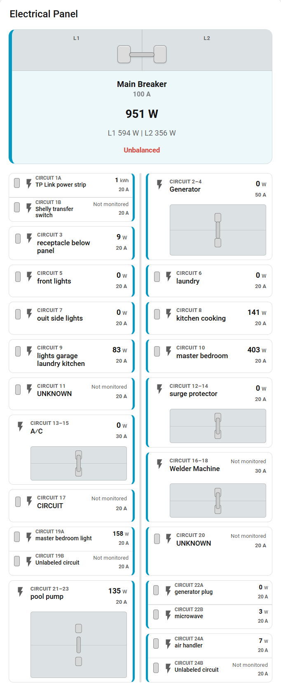

# Home Assistant Electric Panel Card

A configurable Home Assistant dashboard card that models a residential electrical panel using Home Assistant entities.



## Features

- Configurable panel sizes from 8 through 42 physical positions
- Single-pole breakers
- Same-side two-pole breakers using N + 2 pairing
- Tandem, duplex, twin, or piggyback breakers
- Monitored and unmonitored breakers
- Physical panel positions independent from measurement channels
- Breaker ratings and empty filler positions
- Main two-pole breaker visualization with a configurable rating
- Configurable clamp, circuit, or sequential numbering styles
- Configurable measurement and energy decimal precision
- Friendly-name cleanup and two-line wrapping
- A graphical editor with device-aware grouped entity selectors
- Optional **Show all Home Assistant entities** selection
- Loading feedback while Home Assistant registries are queried
- Manual assignment using any compatible Home Assistant entities
- SEM Meter automatic import for up to 16 clamp channels

## Hardware compatibility

Manual entity assignment is hardware-agnostic. Any compatible Home Assistant power, current, or energy sensor can be assigned to the card. Physical panel positions do not have to match measurement-channel numbers, and an entity is optional when a breaker should appear as unmonitored.

Automatic import is specifically designed for SEM Meter entity and mapping conventions. It can discover and import up to 16 SEM Meter clamp channels. Automatic import for other hardware is not provided.

An Emporia Vue running ESPHome can be displayed by manually assigning its Home Assistant entities. Other Home Assistant power sensors work the same way through manual assignment.

## Installation

### HACS custom repository

1. Open HACS.
2. Open the three-dot menu.
3. Choose **Custom repositories**.
4. Add `https://github.com/quky/ha-electric-panel-card`.
5. Select the **Dashboard** category.
6. Install the card.
7. Reload Home Assistant or refresh browser resources if needed.

HACS installs the JavaScript file from this repository's `dist/` directory. It serves the installed file through a `/hacsfiles/` URL and normally manages the dashboard resource automatically.

The repository is prepared for an initial `v1.0.0` release. After that release is published, HACS installations should use GitHub Releases for versioned downloads.

### Manual installation

Copy `dist/ha-electric-panel-card.js` into a directory exposed by Home Assistant's `www` folder. Two common filesystem locations are:

```text
/config/www/ha-electric-panel-card/
```

or:

```text
/homeassistant/www/ha-electric-panel-card/
```

The correct filesystem path depends on the Home Assistant installation. This card's development installation required `/homeassistant/www/ha-electric-panel-card/`; `/config/www/` is not available in every installation.

Add this dashboard resource:

```text
URL: /local/ha-electric-panel-card/ha-electric-panel-card.js
Resource type: JavaScript module
```

During development, append a query parameter to force a browser refresh when the file changes:

```text
/local/ha-electric-panel-card/ha-electric-panel-card.js?v=1
```

## Add the card

Use the graphical card editor or add YAML manually:

```yaml
type: custom:ha-electric-panel-card
title: Electrical Panel
panel_size: 24
show_empty_positions: true
numbering_style: circuit
measurement_decimals: 1
energy_decimals: 2
```

Existing dashboards using `custom:sem-electric-panel-card` remain supported. The legacy name is a compatibility alias backed by the same implementation and graphical editor. Use `custom:ha-electric-panel-card` for new dashboards.

## Configuration overview

The graphical editor is the easiest way to configure the panel. Its entity selectors group choices by the selected Home Assistant device. Enable **Show all Home Assistant entities** when a measurement belongs to another device or when no single device represents the panel.

The main options are:

| Option | Description |
| --- | --- |
| `title` | Card heading. |
| `device_id` | Optional Home Assistant device used by grouped selectors and SEM Meter import. |
| `panel_size` | Even physical position count from 8 through 42. |
| `show_empty_positions` | Shows filler tiles for unused positions. |
| `numbering_style` | `clamp`, `circuit`, or `number`. |
| `measurement_decimals` | Display precision for power and current values: 0, 1, or 2. |
| `energy_decimals` | Display precision for energy values: 0 through 3. |
| `main` | Main breaker name, rating, and optional power/current entities. |
| `clamps` | Up to 16 SEM Meter measurement-channel assignments. |
| `panel_positions` | Manual physical breaker positions independent from clamp channels. |

Breaker entries support:

| Option | Description |
| --- | --- |
| `entity` | Optional compatible Home Assistant entity. Leave empty for an unmonitored breaker. |
| `name` | Display label. Friendly names are cleaned and can wrap to two lines. |
| `circuit` | Circuit label used by the `circuit` numbering style. |
| `circuit_position` / `position` | Physical starting position. |
| `breaker_type` | `single`, `double`, or `tandem`. |
| `breaker_rating` | Breaker amp rating. |
| `icon` | Optional Material Design icon. |
| `unit` | `auto`, `W`, `kW`, or `A`. |
| `tandem_entity` | Optional second entity for a tandem breaker. |

A `double` breaker occupies its starting position and the same-side N + 2 position. A `tandem` breaker displays two independent circuits in one physical position. See [`example-dashboard.yaml`](example-dashboard.yaml) for a complete fictional configuration.

## SEM Meter automatic import

Choose the SEM Meter device in the graphical editor, then use automatic import to fill or replace the detected main and clamp assignments. The importer uses SEM-specific entity and mapping metadata, preserves stable clamp mappings, and supports up to 16 clamp channels.

Manual configuration remains available when automatic discovery is unavailable or when entities come from another device. Automatic import does not create or alter manual `panel_positions` entries.

## Development and validation

The card has no build step. The HACS distributable is `dist/ha-electric-panel-card.js`.

Run the local checks with Node.js:

```text
node --check dist/ha-electric-panel-card.js
node --check ha-electric-panel-card.test.js
node ha-electric-panel-card.test.js
```

The GitHub Actions workflow also parses `hacs.json` and `example-dashboard.yaml` and runs HACS repository validation.

## License

Released under the [MIT License](LICENSE).
